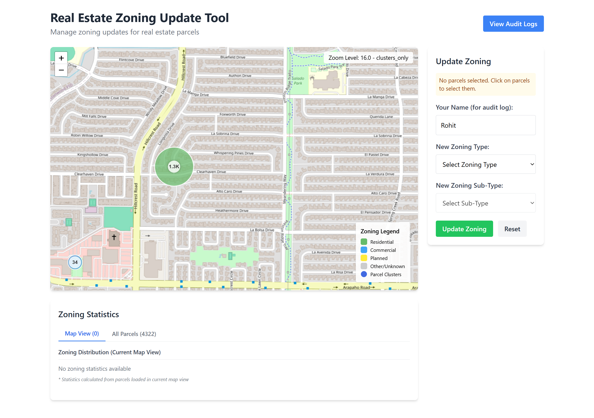
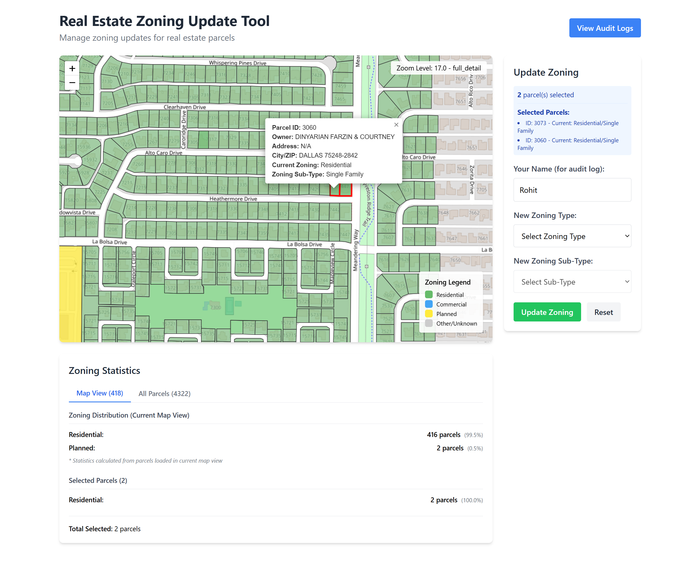

# Real Estate Zoning Update Tool

A web application for visualizing and updating zoning information for real estate parcels. This tool allows users to view parcels on a map, select them, and update their zoning information while maintaining an audit log of all changes.




## 🚀 Live Demo

Try it out: [Zoning App Live Demo](https://zoning-app.rohitrana.dev)

## Technologies Used

### Backend

- **Java 17** with **Spring Boot 3.4.5**
- **PostgreSQL** with **PostGIS** extension for spatial data
- **Hibernate Spatial** for ORM with geospatial data
- **Spring Data JPA** for database access
- **Spring AOP** for audit logging
- **Caffeine** for in-memory caching

### Frontend

- **React 19.1.0** for UI components
- **Leaflet** and **React-Leaflet** for interactive maps
- **Axios** for API communication
- **Tailwind CSS** for styling
- **LocalStorage** for mock data persistence in development

## Core Features

1. **Interactive Map Visualization**

   - Dynamically loads parcel data based on current map view
   - Clustering for efficient visualization at lower zoom levels
   - Color-coding based on zoning types

2. **Zoning Management**

   - Select parcels on the map
   - Update zoning type and sub-type for selected parcels
   - View statistics about zoning distribution

3. **Audit Logging**
   - Track all zoning update operations
   - Store user information and timestamps
   - View and filter audit logs

## Architecture and Key Components

### Backend Architecture

The backend follows a layered architecture:

1. **Controllers** - Handle HTTP requests and responses

   - `ParcelController` - Endpoints for parcel data and zoning updates
   - `AuditController` - Endpoints for audit log access

2. **Services** - Business logic implementation

   - `ParcelService` - Parcel management and zoning updates
   - `AuditService` - Audit logging functionality

3. **Repositories** - Database access

   - `ParcelRepository` - Data access for parcel entities with spatial queries

4. **Models** - Entity definitions

   - `Parcel` - Main entity representing a real estate parcel with geometry

5. **DTOs** - Data Transfer Objects
   - `ParcelDTO` - For transferring parcel data to frontend
   - `ClusterDTO` - For map clustering data
   - `ZoningUpdateRequest` - For zoning update requests

### Frontend Architecture

The frontend is organized into components:

1. **App.js** - Main application component
2. **Map.js** - Interactive map with parcel visualization
3. **ZoningControls.js** - UI for updating zoning information
4. **Statistics.js** - Displays zoning statistics
5. **AuditLogViewer.js** - Displays audit logs
6. **apiService.js** - Handles API communication
7. **mockDataHandler.js** - Provides mock data for development

## Key Technical Challenges & Solutions

### Dynamic Data Loading

The map uses a dynamic loading strategy based on the current view and zoom level:

- At low zoom levels, parcels are clustered for performance
- As the user zooms in, more detailed data is loaded
- Data is cached to prevent redundant loading

Implementation:

- Backend: SQL query with dynamic grouping based on zoom level
- Frontend: Tracking loaded areas and requesting only new data

### Spatial Data Management

Handling geospatial data requires specialized tools:

- PostGIS extension for PostgreSQL
- Hibernate Spatial for ORM mapping
- GeoJSON format for data transfer
- Leaflet for frontend visualization

### Audit Logging

The application maintains a comprehensive audit trail:

- AOP (Aspect-Oriented Programming) captures operations automatically
- Detailed before/after state recording
- JSON-based log storage with retention policies

## Setup Instructions

### Backend Setup

1. **Prerequisites**

   - Java 17
   - PostgreSQL 13+ with PostGIS extension
   - Maven

2. **Database Setup**
   ```sql
   CREATE DATABASE zoning_data;
   CREATE EXTENSION postgis;
   ```
3. **Configure Application**

- Update application.properties with your database credentials
- Set audit log configuration as needed

4. **Build and Run**
   ```bash
   mvn clean install
   mvn spring-boot:run
   ```

### Frontend Setup

1. **Prerequisites**

   - Node.js 18+
   - npm or yarn

2. **Install Dependencies**

   ```bash
   npm install
   ```

3. **Development Mode**

   ```bash
   # Run with API connection (needs backend running)
   npm start

   # Run with mock data (no backend required)

   REACT_APP_MOCK_DATA=true npm start
   ```

4. **Build for Production**

   ```bash
   npm run build
   ```
